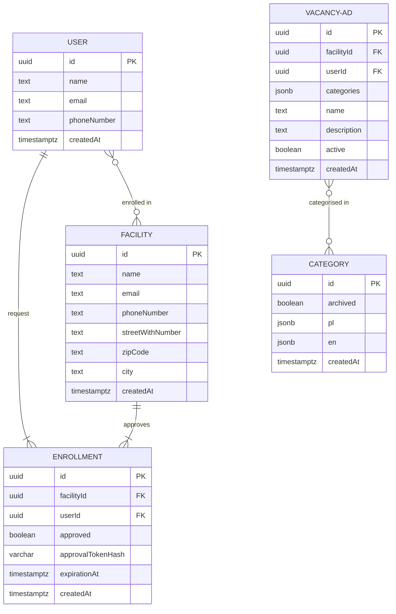

# Entity Relationship Model

## Useful links

- Article on Wikipedia about [ER model](https://en.wikipedia.org/wiki/Entity%E2%80%93relationship_model)
- Creating ER diagrams with [Mermaide](https://mermaid-js.github.io/mermaid/#/entityRelationshipDiagram)
- VS Code extension [Markdown Preview Mermaid Support](https://marketplace.visualstudio.com/items?itemName=bierner.markdown-mermaid)

## Diagram

